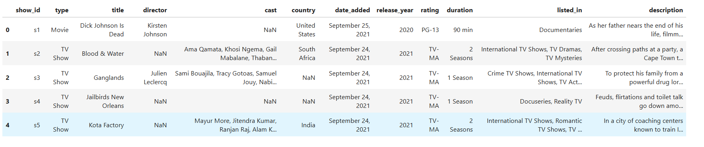
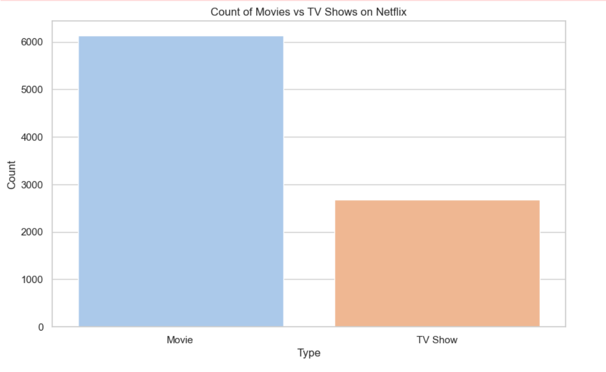
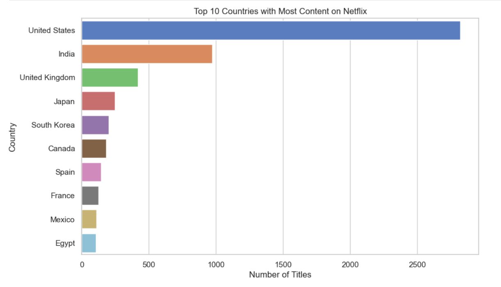
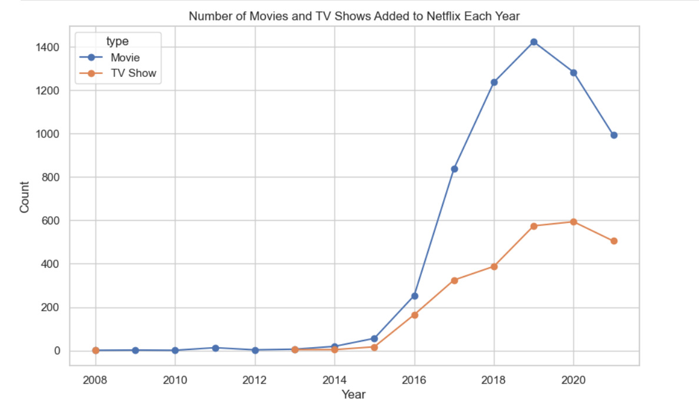
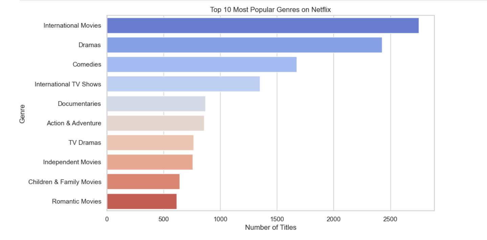

# CodeAlpha Internship - Task 3: Data Visualization

This project is a part of the 1-month Data Analytics Internship by **CodeAlpha**.

## 🎯 Project Objective
To transform the Netflix dataset into clear and impactful visualizations using Python libraries. The aim is to communicate trends and patterns effectively through data storytelling.

## 📁 Dataset Information
- **Name:** Netflix Titles Dataset  
- **Source:** [Kaggle](https://www.kaggle.com/datasets/shivamb/netflix-shows)  
- **File Used:** `netflix_titles.csv`

## 🧰 Libraries & Tools Used
- Python 3  
- Pandas  
- Matplotlib  
- Seaborn  
- Jupyter Notebook (via Anaconda)

## 🖼 Dataset Preview  

## 📈 Visualizations Created

1. 📊 **Count of Movies vs TV Shows**  
   - Bar plot comparing the number of movies and TV shows.  
   

2. 🌍 **Top 10 Countries with Most Content**  
   - Horizontal bar chart showing countries with the most Netflix content.  
   

3. 📅 **Content Added Over Time**  
   - Line chart showing Movies and TV Shows added each year.  
   

4. 🎭 **Top 10 Most Popular Genres / Movie Duration**  
   - Bar chart of most popular genres OR histogram of movie duration.  
   

## 📂 Files Included
- `CodeAlpha_Task3_Visualization.ipynb` — Jupyter Notebook  
- `netflix_titles.csv` — Dataset used  
- `screenshots/` — Folder containing all 5 output screenshots  

## 🏁 Outcome
This task helped build practical skills in:
- Data visualization using Python
- Presenting insights clearly
- Understanding content trends on Netflix

## 🔖 Project Name
**CodeAlpha_Task3_Visualization**
