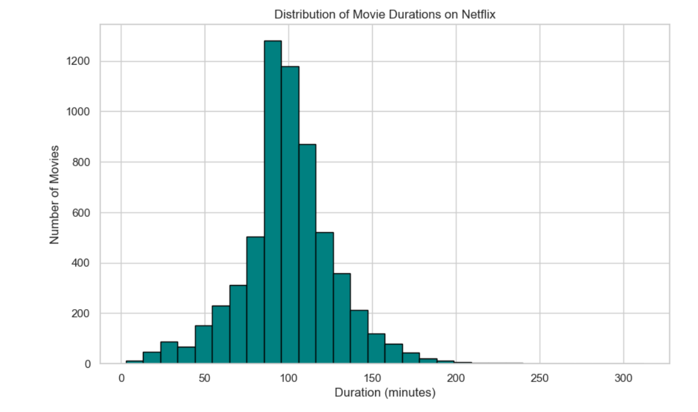

# CodeAlpha Internship - Task 3: Data Visualization

This project is a part of the 1-month **Data Analytics Internship** by **CodeAlpha**.

---

## 🎯 Project Objective

To transform the Netflix dataset into clear and impactful visualizations using Python libraries. The aim is to communicate trends and patterns effectively through data storytelling.

---

## 📁 Dataset Information

- **Name:** Netflix Titles Dataset  
- **Source:** [Kaggle](https://www.kaggle.com/datasets/shivamb/netflix-shows)  
- **File Used:** `netflix_titles.csv`

---

## 🖼 Dataset Preview

Below is a preview of the raw Netflix dataset used in this task:

---

## 🧰 Libraries & Tools Used

- Python 3  
- Pandas  
- Seaborn  
- Matplotlib  
- Jupyter Notebook (via Anaconda)

---

## 📈 Visualizations Created

1. 📊 **Count of Movies vs TV Shows**  
   Bar plot comparing the number of Movies and TV Shows available on Netflix.  
   

2. 🌍 **Top 10 Countries with Most Content**  
   Horizontal bar chart showing top countries by content count.  
   

3. 📅 **Content Added Over Time**  
   Line graph displaying how much content has been added to Netflix each year.  
   

4. 🎭 **Top 10 Most Popular Genres**  
   Bar chart of the most common genres across all Netflix titles.  
   

5. ⏱ **Movie Duration Distribution**  
   Histogram visualizing the distribution of movie durations.  
   

---

## 📂 Files Included

- `CodeAlpha_Task3_Visualization.ipynb` — Jupyter Notebook with complete visualizations  
- `netflix_titles.csv` — Dataset used  
- `screenshots/` — Folder with output screenshots used in README

---

## 🏁 Outcome

This task enhanced my understanding of:
- Data storytelling using visualizations
- Visual tools like Seaborn & Matplotlib
- Presenting complex datasets in a simple and meaningful way

---

## 🔖 Project Name

**CodeAlpha_Task3_Visualization**

